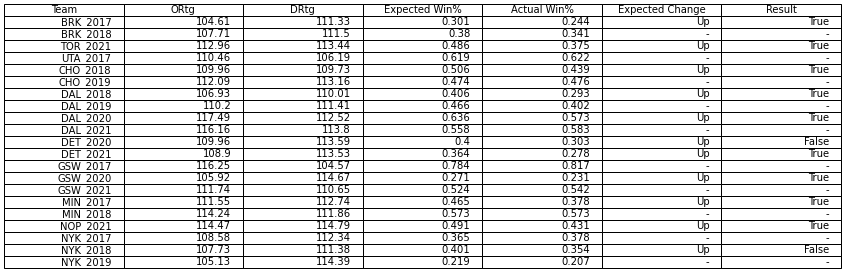
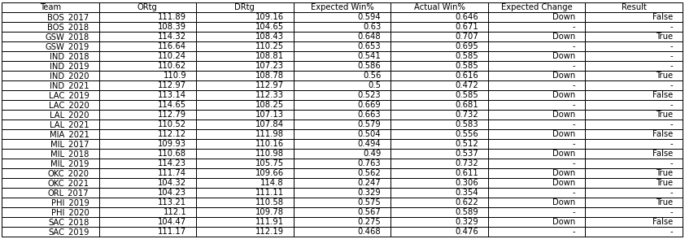
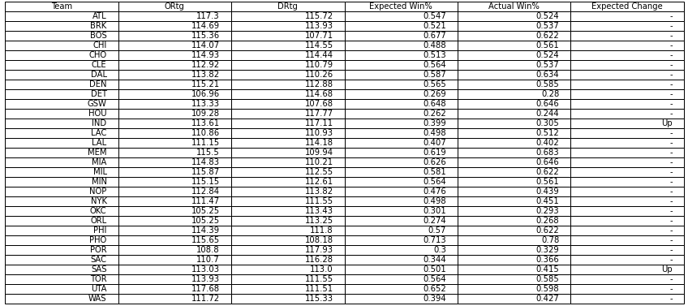

# Dean's Oliver Bell Curve Method for Recent NBA Seasons
- Testing Oliver's Bell Curve Method over 2017-2022 NBA season.
- Scraped game logs for each team using Python and BeautifulSoup.
- Identified Limitations of the method.
- Predicted improvement/declined for teams that met the criteria in the upcoming season.

## Code and Resources Used
**Python Version**: 3.8.8

**Packages**: pandas, numpy, matplotlib.pyplot, scipy.stats

[Basketball on Paper: Rules and Tools for Performance Analysis by Dean Oliver](https://www.amazon.com/Basketball-Paper-Rules-Performance-Analysis/dp/1574886886)

## Introduction
Chapter 10 of Oliver's book utilised the bell curve method in order to predict whether a team will improve or decline in the upcoming season. Within his predictions,
18 out of 23 teams that deviated from their bell curve projection by more than one standard deviation in expected winning percentage over the 1997 to 2003 season 'changed
the next year in the direction of the bell curve projection'. The method quantifies the idea that teams who deviate from their projection are either inconsistent or lucky,
and that their actual win percentage does not truly reflect where a team is actually at. Oliver suggests that inconsistent 'bad' teams tend to win more games, and vice versa
for inconsistent 'good' teams.

This project replicates the method over 2017-2022 NBA season to examine whether it remains valid for future projections.

### Web Scraping
Scraped game logs for each team between 2017-2022 from basketball-reference.com.

## Formula
This is the formula for expected win percentage introduced by Oliver, inspired by the basketball adaptation of Bill James' [Pythagorean Winning Percentage](https://www.nbastuffer.com/analytics101/pythagorean-winning-percentage/#:~:text=Pythagorean%20Winning%20Percentage%20is%20a,of%20points%20scored%20and%20allowed.&text=Refer%20to%20the%20team%20stats,winning%20percentages%20for%20the%20seasons.):

![Win\%&space;=&space;&space;NORM\left[\frac{ORtg&space;-&space;DRtg}{\sqrt{var(ORtg)&space;&plus;&space;var(DRtg)&space;-&space;2cov(ORtg,&space;DRtg)}}\right]](https://latex.codecogs.com/svg.image?Win\%&space;=&space;&space;NORM\left[\frac{ORtg&space;-&space;DRtg}{\sqrt{var(ORtg)&space;&plus;&space;var(DRtg)&space;-&space;2cov(ORtg,&space;DRtg)}}\right]) 

where ORtg = average offensive rating, DRtg, average defensive rating, var(ORtg) = variance of offensive rating, var(DRtg) = variance of defensive rating,
cov(ORtg, DRtg) = covariance of offensive and defensive rating, and norm() = value that represents how much of a standard bell curve is above a certain value.

## Method
The bell curve method consists of 3 steps:
1. The formula for expected winning percentage was used on each team for their performance each season. Offensive and defensive rating can be replaced by points scored and 
points allowed, as suggested by Oliver.
2. Each team's actual winning percentage was calculated. 
3. A team's improvement or decline was determined if their actual winning percentage deviated from expected winning percentage by one or more standard deviation.

A challenge met while executing this method was determining the standard deviation of expected winning percentage. It was concluded that a specified column for rolling 
expected winning percentage during the season was required. Full execution of the method including engineering of the data was included in [model.ipynb](https://github.com/alex1031/bell_curve_model/blob/main/model.ipynb).

## Result
There were 23 teams over the previous 5 seasons that deviated from their expected percentage by one standard deviation or more. 16 (70%) of them improved/declined the next year in the direction of the curve projection, as can be seen in the images below. There was one special case in 2017-18 Indiance Pacers, where their actual win percentage remained the same despite expecting a decline.

## Discussion and Limitation
The results obtained were similar to Oliver's, with difference of 2 (1 if the 2017-18 Pacers was counted as a correct prediction). 

Despite the method's accuracy, there were factors that was not accounted for, such as the decision for a team to pursue major roster overhauls, either from trading away good players for a rebuild, or signing elite free agents that pushes them into championship contention. This can be seen affecting the prediction for the 2019-20 Clippers, where in the off-season was able to attract top-tier free agents Paul George and Kawhi Leonard, pushing them from an 8th seed team to finishing 2nd in the Western Conference the next season. 

Furthermore, variance of team offensive and defensive ratings could be affected in the 2019-20 and 2020-21 season, where they played 10-16 less games (depending on the team) due to the pandemic, compared to the traditional 82 games. 

Overall, it can be deduced that the method still holds up in recent NBA seasons. However, it would serve better purpose as a supplementary indication for further analysis.

## Prediction for the upcoming season (2022-23)
The bell curve method was used for the 2021-22 NBA season, as can be seen in the image below. Improvement in the upcoming season can be expected from the Indiana Pacers and San Antonia Spurs.

However, as discussed above, the method does not acount for major roster changes, as demonstrated by the Spurs, trading away their star player Dejounte Murray to pursuit another rebuild. This makes the improvement in the upcoming season very unlikely. Similarly, Indiana traded away one of their best players in Malcolm Brogdon. However, it is not unlikely that they will improve from their previous season with promising young talent on the roster.

## Further Improvements
Detecting major roster movements can be another criteria to add on top of deviation from expected winning percentage in order to improve accuracy of prediction. In addition, it can be explored whether there are other parameter that can be included in the equation for telling a more complete story about a team's true strength.

